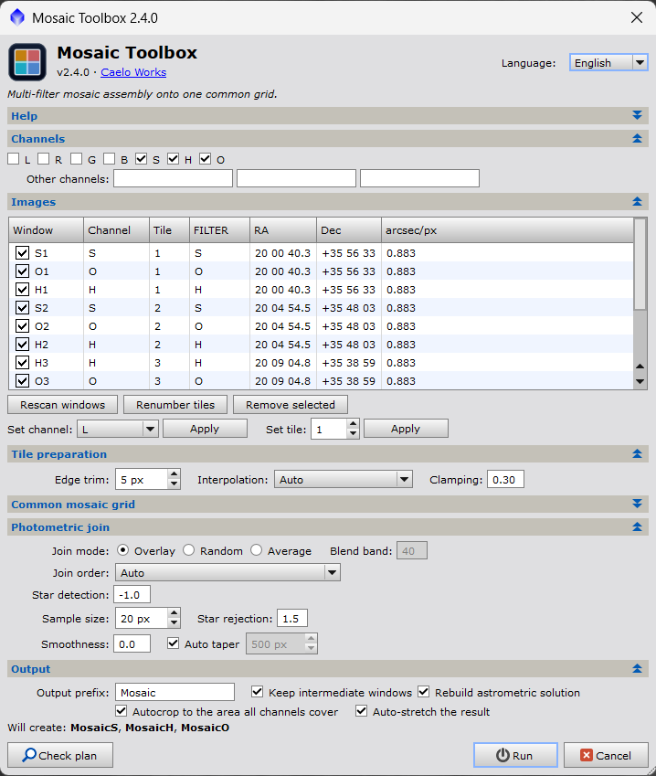

<div align="center">

# Mosaic Toolbox

### Several filters of a mosaic, assembled onto one common grid in a single run

[](https://github.com/caelo-works/pix-mosaic-toolbox/releases/latest)
[](https://pixinsight.com/)
[](https://pixinsight-scripts.caelo.works/en/scripts/pix-mosaic-toolbox)
[](LICENSE)
[](https://pixinsight-scripts.caelo.works/en)

[](https://pixinsight-scripts.caelo.works/en)

</div>

---

## Overview

A PixInsight script that assembles a multi-filter mosaic in one pass. It reprojects every
plate-solved tile onto **one** common astrometric grid, erodes the soft reprojection edges, and
joins the tiles photometrically — star flux ratios for the brightness scale, a smoothed surface
spline for the residual gradient.

    Plate-solved tiles          →     MosaicL   MosaicR   MosaicG   MosaicB
    (L, R, G, B, S, H, O …)           MosaicS   MosaicH   MosaicO   Mosaic<yours>

Every output shares **identical coordinates, field of view, orientation and pixel dimensions**, so
they combine straight away (ChannelCombination, PixelMath, LRGB, SHO …) with no further
registration.

**Self-contained.** Nothing to install but this script. Version 1 drove PhotometricMosaic;
version 2 has its own photometric join engine and no external dependency at all.

**English and French** throughout — dialog, tooltips, console output, warnings and errors. Pick the
language from the header; it switches the whole window in place, and the choice is remembered.



---

## What it replaces

The usual manual sequence is:

1. `ImageSolver` on every tile
2. `MosaicByCoordinates` — once per filter, hoping each run lands on the same grid
3. `TrimMosaicTile` — once per reprojected tile
4. A photometric mosaic join — once per join, per filter, by hand

Mosaic Toolbox does steps 2 – 4 in one pass, and computes the grid from **all**
filters together so step 2's "hoping" is removed by construction.

You still run `ImageSolver` yourself (step 1).

---

## Platforms

Windows, macOS and Linux, from the same files. PixInsight runs the same
JavaScript engine on all three and this script touches nothing outside it — no
files, no shell, no OS paths — so there is no port to do and no per-platform
build. Install it the same way everywhere.

What *is* handled explicitly, because it genuinely differs:

* **Display scaling.** Every spacing and margin goes through PixInsight's scaled
  setters, and every width is derived from the current UI font, so the dialog
  follows a Retina Mac or a 150%-scaled Windows desktop rather than shrinking to
  a third of its intended size.
* **Larger default fonts.** macOS and most Linux desktops render UI text taller
  than Windows. The dialog measures itself and will not open taller than about
  860 logical pixels, so the Run button stays reachable on a 13" laptop.
* **Case-sensitive filesystems.** The `#include` paths match the real filenames
  exactly, which only Linux would have caught.
* **Locale.** The astrometric `CRPIX` keywords are written with `toFixed()`
  rather than a printf `%f`, so a French or German desktop session cannot put a
  decimal comma into a FITS card.

The one thing you must preserve when installing: keep `MosaicToolbox.js` and the
`mosaictoolbox/` folder together, with that folder name and the module filenames
unchanged.

---

## Requirements

| | |
|---|---|
| PixInsight | ≥ 1.9.4 (Lockhart), Windows / macOS / Linux |
| Input images | linear, plate solved, **gradient corrected**, one window per tile per filter |

> **Correct the gradients before you assemble.** YAGEx, DBE, ABE, GraXpert, or
> NormalizeScaleGradient during preprocessing — whichever you use, run it on
> every tile first.
>
> The join measures the brightness *difference* between two tiles across their
> overlap and cancels it. That is not the same as removing a gradient. A gradient
> the two tiles share is invisible to the measurement and passes straight
> through, and a strong uncorrected gradient in a single tile gets carried across
> the whole mosaic rather than fixed by it — the model faithfully reproduces
> whatever it was given. Matching tiles to each other and flattening the sky are
> two different jobs; this script does only the first.

Otherwise that is the whole list. The script uses only core PixInsight objects —
`StarDetector`, `SurfaceSpline`, `AstrometricMetadata`, `ImageReprojection`.

---

## Installation

### Through the CaeloWorks update repository (recommended)

Updates then arrive on their own, along with every other CaeloWorks script.

1. In PixInsight: **Resources → Updates → Manage Repositories**.
2. **Add** `https://pixinsight-scripts.caelo.works/update/`.
3. **Resources → Updates → Check for Updates**, then restart PixInsight.

The repository is not yet signed with a Certified PixInsight Developer identity, so PixInsight
warns that it is unsigned. That is expected, and affects every CaeloWorks script equally.

### From a release

Download `MosaicToolbox-<version>.zip` from the
[releases](https://github.com/caelo-works/pix-mosaic-toolbox/releases) and unzip
it over your PixInsight installation directory — it carries the
`src/scripts/CaeloWorks/…` tree PixInsight expects. It then appears under
**Script → CaeloWorks → Mosaic Toolbox**.

Requires PixInsight 1.9.4 or later.

### From the source tree

Copy `MosaicToolbox.js` and the `mosaictoolbox/` folder from `pjsr/`, keeping
them together, anywhere PixInsight can read — e.g.
`<PixInsight src>/scripts/MosaicToolbox/`:

```
MosaicToolbox/
├── MosaicToolbox.js
└── mosaictoolbox/
    ├── MT_Lang.js        MT_Overlap.js
    ├── MT_Globals.js     MT_Photometry.js
    ├── MT_Data.js        MT_Gradient.js
    ├── MT_Astrometry.js  MT_Join.js
    ├── MT_Engine.js      MT_Dialog.js
    └── ...
```

Then **Script → Feature Scripts… → Add**, select that folder, and it appears
under **Script → CaeloWorks → Mosaic Toolbox**. (Or just **Script → Execute Script
File…** and pick `MosaicToolbox.js`.) The menu icon in `pjsr/assets/` is
optional when installing by hand.

The one thing you must preserve: keep `MosaicToolbox.js` and the `mosaictoolbox/`
folder together, with that folder name and the module filenames unchanged.

---

## Using it

1. Open every tile of every filter you want to assemble. All linear, all plate
   solved, all already corrected for gradients.
2. **Script → CaeloWorks → Mosaic Toolbox**.
3. Set **Language** if you want French. The dialog retranslates in place, table
   and settings intact, and the choice is remembered for next time. Everything
   the script prints to the console follows it too.
4. Check the table. Each row is one open image:

   | Column | Meaning |
   |---|---|
   | ✓ | include this image |
   | Window | the view identifier |
   | Channel | derived from the `FILTER` keyword |
   | Tile | derived from the sky coordinates — same number = same patch of sky |
   | FILTER | the raw keyword value, for reference |
   | RA / Dec / arcsec-px | from the astrometric solution |

   Anything the auto-detection got wrong: select the rows, pick a value in
   **Set channel** / **Set tile**, press **Apply**. Rows that will not be used
   are greyed out.

5. **Channels** is already set for you: scanning ticks exactly the filters that
   images were found for and unticks the rest, so an SHO project never arrives
   with L, R, G and B still ticked from last time. Change it if you want fewer.
   Filters the script does not know (`Ha 3nm`, `NIR`, `CaK` …) are offered as
   named "other" channels — up to three, and you can rename them.
6. Press **Check plan** to see the computed grid and the join order in the
   console without processing anything.
7. Press **Run**. The console's abort button stops cleanly between tiles and
   between joins; channels already finished are kept.

### Output

One window per channel: `MosaicL`, `MosaicR`, … using the **Output prefix**
(default `Mosaic`). Each carries a rebuilt astrometric solution, `FILTER` set to
the channel key, and a full `HISTORY` of every join — scale factor and star
count per channel, sample count, smoothness, taper length, join mode.

With **Autocrop** ticked, every mosaic is cropped to the largest rectangle in
which *all* the channels hold data everywhere: no empty border, no black wedges
in the corners, no ragged edge left to trim by hand. The sky outside that
rectangle is discarded.

Cropping to the bounding box of the data is not offered, because it is useless
for the case that matters: a mosaic whose grid is rotated relative to its tiles
has corners reaching almost to the edge of the canvas, so the bounding box is
nearly the whole grid and every wedge survives.

The rectangle is computed once from *all* the finished channels together and
applied to every one of them, so the outputs stay identical in geometry —
cropping each channel to its own data would undo the single guarantee the common
grid exists to provide. The astrometric solution is carried through the crop,
and a failed crop never costs you the mosaics: they are left intact and uncropped
with a message.

With **Auto-stretch the result** ticked (on by default) each finished mosaic gets
an auto-stretch screen transfer function, so you see the result instead of a
black frame. This is a *display* stretch — the same one the STF auto-stretch
button applies. No pixel is modified and the mosaics stay linear, ready for
channel combination or further processing; clear it any time from the STF window.
The statistics are taken from the mosaic's data area only, so the black surround
of an uncropped mosaic cannot skew it.

Intermediate windows are closed as they are consumed, unless you tick **Keep
intermediate windows**.

---

## How it works

```
  all tiles, all filters
          │
          ▼
   ①  one common grid          resolution = finest of all tiles
      (MT_Astrometry.js)       rotation   = first tile
                               centre     = iteratively optimised over the union
                               size       = smallest canvas holding every tile
          │
          ▼
   ②  per channel: reproject each tile onto that grid
          │
          ▼
   ③  erode N px from every tile outline
          │
          ▼
   ④  join tiles into strips, then strips into the mosaic
          │
          ▼
   ⑤  rename, tag, re-solve
          │
          ▼
   ⑥  optional: one crop rectangle for all channels
          │
          ▼
   ⑦  optional: auto-stretch each result (screen only)
```

**Why the grid is computed from every filter at once.** The grid is derived from
the union of all participating tiles *before* any channel is processed. Running
MosaicByCoordinates separately per filter gives each filter a slightly different
centre and canvas, because each run only sees its own tiles. Here there is one
grid and every channel is written onto it.

**Join order.** Tiles are joined two at a time, so the script clusters them by
position on the common grid, builds rows (or columns, whichever gives fewer and
longer strips), then joins those strips — and applies the *same* sequence to
every channel. Override with **Join order**.

**A channel with missing tiles.** If, say, only L has tile 5, the other channels
are split into the contiguous fragments they do have, and those fragments are
joined in an order that keeps each one overlapping what has been assembled so
far. If a fragment cannot reach the rest at all, that channel says which tiles
are stranded and the other channels carry on.

### The photometric join

Each join runs on two images that are already pixel-for-pixel co-registered on
the common grid — which is what makes the measurement clean:

1. **Overlap.** Bounding box of each tile's non-zero pixels, then a per-pixel
   mask of where both hold data.
2. **Stars.** `StarDetector` on the shared region of both images; the two lists
   are merged so a star faint in one is not lost.
3. **Scale.** Aperture photometry of every star, in both images, with an
   *identical aperture at an identical position* — so aperture losses,
   centroiding error and PSF differences cancel in the ratio instead of adding
   noise to it. The flux ratios are fitted robustly (median start, then weighted
   least squares through the origin with 3σ rejection, iterated). If the overlap
   holds too few usable stars, the scale falls back to a sigma-clipped
   regression of the shared pixels, and says so.
4. **Gradient.** A grid of star-free sample squares over the shared region gives
   the residual `reference − scale × target`. A smoothed `SurfaceSpline` is
   fitted to it, then refitted once with 3σ outliers against the first fit
   removed — clipping against the fit rather than the median means a real, large
   gradient is followed rather than rejected.
5. **Apply.** The correction is evaluated on a 16-pixel lattice and bilinearly
   interpolated (a spline is smooth by construction; per-pixel evaluation would
   be far slower for no gain). Beyond the overlap the spline is **not**
   extrapolated — it is held at its value along the overlap edge and faded into
   a single constant offset over the taper distance.

---

## Settings that matter

**Edge trim** (default 5 px). Reprojection and integration both leave partially
covered pixels around a tile's outline; left in place they show up as fine
bright or dark lines along the joins. 5 px suits most data; increase it if you
still see lines, set 0 if your tiles were already trimmed.

**Smoothness** (default 0). How closely the gradient model follows the samples,
as a log₁₀ value. The residuals are normalised before fitting, so this means the
same thing on every data set: **0** lets the fit deviate from the samples by
about one robust sigma of their scatter — it smooths through the noise but
follows real structure. Lower hugs the samples and risks absorbing nebulosity
into the model; higher gives a stiffer surface that may leave a residual
gradient at the join.

**Sample size** (default 20 px). The squares the gradient is measured on. Large
enough to average down the noise, small enough to follow the gradient. Reduced
automatically for one join if the overlap is too thin to fit six squares across.

**Star detection** (default −1). Log sensitivity, the PixInsight default. Lower
finds fainter stars — useful when a sparse overlap yields too few for the scale.

**Join mode.** *Overlay* is the normal choice: a hard cut at the join line,
which is what you want once the gradient has been matched. *Random* breaks up
the seam without softening stars. *Average* has the lowest noise but doubles
stars if the registration is imperfect.

**Autocrop** (off by default). See *Output* above. Leave it off if you want to
keep every pixel the mosaic covers and crop by hand later.

**Auto-stretch the result** (on by default). Screen only; costs nothing and
changes no data.

**Language** (in the header). English or French. Changing it retranslates the
whole dialog in place; nothing you have set is lost. FITS `HISTORY` records stay
in English whatever you pick, so a mosaic built in French is still readable by
anyone.

**Common mosaic grid** (collapsed section). Everything is automatic by default.
Override resolution, rotation, centre, projection or dimensions here if you need
a specific canvas — for example to match an existing mosaic.

---

## Notes and limits

* **Memory.** A reprojected tile is as large as the whole mosaic canvas. The
  script processes one channel at a time and closes each tile the moment it has
  been joined. Even so a large mosaic wants a lot of RAM and swap; "Keep
  intermediate windows" multiplies that, so use it only for diagnosis.
* Zero means "no data" throughout the pipeline. A corrected pixel that would
  fall below zero is clipped to a tiny positive value rather than to zero, so it
  stays part of the mosaic's coverage; the console reports how many.
* The script never modifies your source windows. It only reads them.
* Colour (RGB) tiles work — each channel is scaled and corrected independently.
  Filter detection is aimed at mono-per-filter data, so assign a channel by hand.
* Settings persist under the `MosaicToolbox/` settings key.

### How this compares to PhotometricMosaic

If you own [PhotometricMosaic](https://astroprocessing.com/) by John Murphy it
remains an excellent and considerably more refined tool: far more tuning, and
interactive diagnostics — detected stars, photometry graphs, sample grids,
gradient profiles — that let you inspect a join before committing to it. Mosaic
Toolbox deliberately does not reproduce any of that; it is built for the
unattended multi-filter case, and reports through the console instead. The two
implementations are independent, so their results will differ in detail. None of
PhotometricMosaic's code is used, copied or required here.

---

## Troubleshooting

**"No plate-solved image is open."**
Run **Script → Image Analysis → ImageSolver** on your tiles first.

**"… do not overlap."**
Two tiles the layout thinks are adjacent share no sky. Usually a wrong tile
number — check the Tile column, or press **Renumber tiles**.

**"The target image … lies entirely inside …"**
Two images share a tile number. Fix the numbering, or untick one.

**"Only N star-free sample square(s) fit in the overlap."**
Reduce **Sample size**, or lower **Star rejection** so fewer squares are
discarded around stars.

**"… too thin to model a two-dimensional gradient."**
The usable overlap is one square wide. Reduce **Sample size**; if that does not
help, those tiles genuinely need more overlap.

**"scale estimated from the overlap pixels instead" (warning).**
Too few stars were measurable. Lower **Star detection** towards −2 to find
fainter ones. The pixel fallback is biased by nebulosity, so treat that join with
suspicion.

**"… were not finite … the gradient model diverged."**
The spline went unstable, almost always from too few or too poorly distributed
samples. Raise **Smoothness**, or reduce **Sample size** to get more of them.

**Fine lines along a join.** Increase **Edge trim**.

**A dark or bright wedge spreading from a join.** Raise **Smoothness** so the
model stops chasing nebulosity, or check that the tiles were background
neutralised consistently. NormalizeScaleGradient during preprocessing helps a
lot here.

**A gradient across the finished mosaic.** The tiles were not gradient corrected
before assembly, or they share a gradient the join cannot see. Correct each tile
(YAGEx / DBE / ABE / GraXpert) and run again — correcting the assembled mosaic afterwards
is harder, because the join has by then folded each tile's gradient into its
neighbours.

---

## Files

| File | Contents |
|---|---|
| `pjsr/MosaicToolbox.js` | entry point and `#include`s |
| `pjsr/mosaictoolbox/MT_Lang.js` | English/French catalogue and the `mtT()` lookup |
| `pjsr/mosaictoolbox/MT_Globals.js` | version, filter table, FITS/identifier/statistics helpers |
| `pjsr/mosaictoolbox/MT_Data.js` | data model and settings persistence |
| `pjsr/mosaictoolbox/MT_Astrometry.js` | common grid, reprojection, edge erosion, autocrop, screen stretch |
| `pjsr/mosaictoolbox/MT_Overlap.js` | bounding boxes, overlap mask, join orientation |
| `pjsr/mosaictoolbox/MT_Photometry.js` | star detection, aperture photometry, scale fit |
| `pjsr/mosaictoolbox/MT_Gradient.js` | sample grid, surface spline, correction field, application |
| `pjsr/mosaictoolbox/MT_Join.js` | one complete photometric join |
| `pjsr/mosaictoolbox/MT_Engine.js` | grid → layout → per-channel assembly |
| `pjsr/mosaictoolbox/MT_Dialog.js` | the user interface |

For the module map and how the pieces fit together, see
[docs/ARCHITECTURE.md](docs/ARCHITECTURE.md). To work on the script, see
[CONTRIBUTING.md](CONTRIBUTING.md).

---

## Credit and licence

**Nicolas Godingen** wrote Mosaic Toolbox, and the heart of it is his — the common grid, the
reprojection, the photometric join, and every default that makes an unattended multi-filter
assembly come out right. He built it against his own mosaics, and it shows in the parts a quicker
tool would have skipped: one grid computed from every filter at once, so the channels land
pixel-for-pixel on each other; a join that measures the scale from matched star apertures before it
ever touches the gradient; and failure messages that name the offending tile and tell you what to
change. Caelo Works is glad to carry it forward — thank you, Nico.

The astrometric grid computation in `MT_Astrometry.js` derives from the **MosaicByCoordinates**
script, © 2013–2026 Andrés del Pozo and © 2019–2026 Juan Conejero (PTeam), used under the PixInsight
Class Library License 2.0.

This product is based on software from the PixInsight project, developed by Pleiades Astrophoto and
its contributors (<https://pixinsight.com/>).

---

## Licence

Licensed under [CC BY-NC 4.0](https://creativecommons.org/licenses/by-nc/4.0/) — share and adapt
freely for non-commercial purposes, with credit. The NonCommercial condition is the author's
deliberate choice, applied across the scripts he maintains with Caelo Works; unlike some of them it
is **not** forced by any upstream work — the MosaicByCoordinates code it builds on is permissive.
[LICENSE](LICENSE) sets that out, and the full attribution chain — which the PixInsight Class
Library License requires to travel with the script — is in [NOTICE.md](NOTICE.md).

Maintained by [Caelo Works](https://caelo.works) with the agreement of the original author. See
[CHANGELOG.md](CHANGELOG.md) for release history, [docs/ARCHITECTURE.md](docs/ARCHITECTURE.md) for
how it is put together, and [CONTRIBUTING.md](CONTRIBUTING.md) if you want to work on it.
